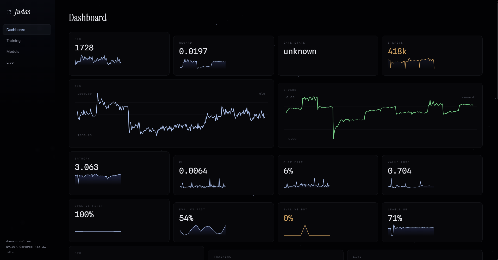
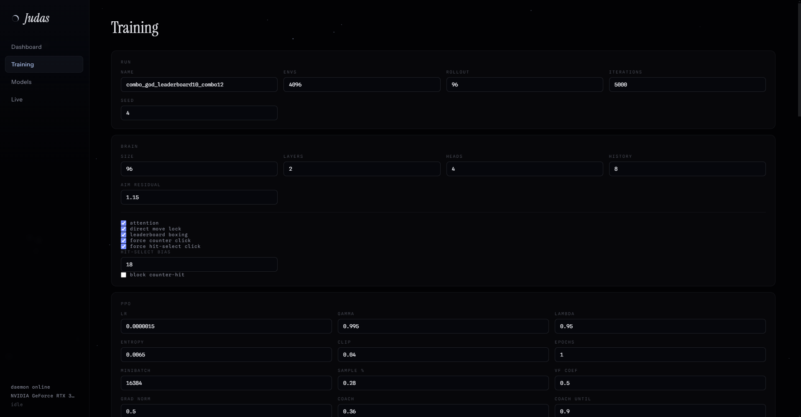
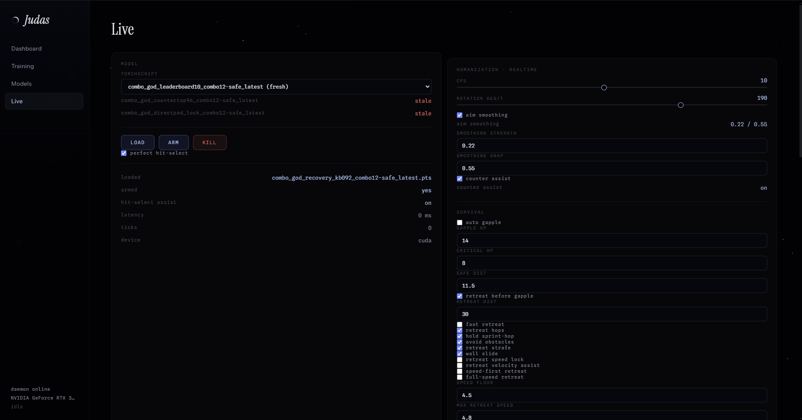
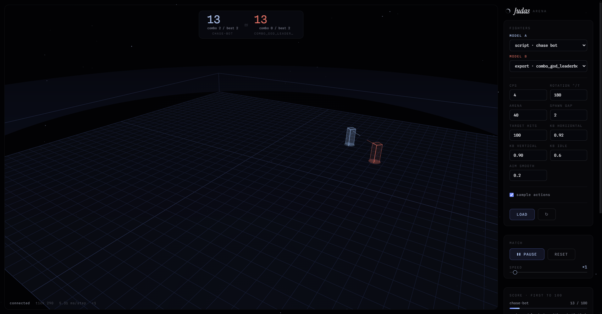
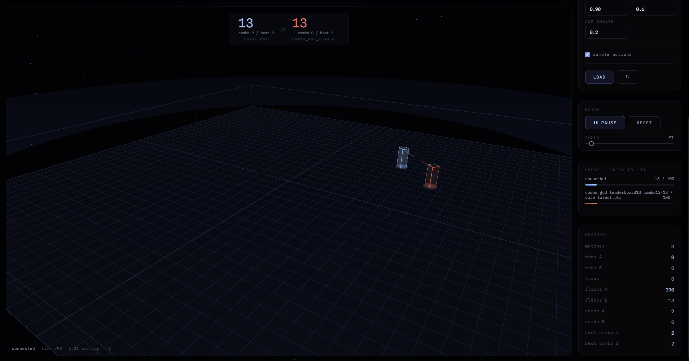

# Judas

Judas est un framework IA, oriente Windows, pour le PvP boxing Minecraft
1.8.9. Il combine un simulateur CUDA exact, l'entrainement PPO en self-play,
du Population Based Training, une app Electron de controle, un visualiseur
d'arene 3D et un mod Forge pour l'inference en jeu.

Documentation anglaise : [README.md](README.md).

> Utilisation responsable : Judas est prevu pour la recherche locale, les tests
> prives et les serveurs ou l'automatisation est explicitement autorisee. Ne
> l'utilisez pas sur des serveurs publics ou des communautes qui interdisent les
> bots, l'automatisation ou l'assistance cote client.

## Ce Que Fait Judas

- Simule la physique boxing Minecraft 1.8.9 a tres haut debit avec une
  extension CUDA chargee par PyTorch.
- Garde un simulateur de reference pur Python dans `sim_ref/` et verifie le
  chemin CUDA contre cette reference.
- Entraine des policies avec PPO self-play, snapshots de league, bots scripts
  et Population Based Training.
- Exporte les checkpoints en modeles TorchScript deterministes pour l'inference
  live.
- Lance un daemon FastAPI et WebSocket utilise par l'app, le visualiseur
  d'arene et le mod Minecraft.
- Fournit un mod Forge 1.8.9 qui lit l'etat du jeu et applique les actions du
  modele.
- Inclut des scripts Windows pour installer, tester, entrainer, exporter,
  verifier le deploiement, verifier l'ordre des paquets et faire des preuves
  terrain.

En boxing Judas, les joueurs ont Speed II, une epee en slot 1 et aucun degat.
Chaque coup ajoute un point, et la cible de hits configuree decide le match.
Les timeouts sont des egalites, donc fuir avec une avance ne devient pas une
strategie gagnante.

## Captures De L'interface

L'app Electron et le visualiseur d'arene 3D donnent acces aux metriques
d'entrainement, au controle live des modeles et a la lecture des matchs simules
dans un meme workflow local.

| Tableau de bord | Entrainement |
|---|---|
|  |  |

| Controle live | Visualiseur d'arene |
|---|---|
|  |  |



## Structure Du Depot

```text
judas/
|-- sim/        Simulateur CUDA/PyTorch et sources du kernel compile
|-- sim_ref/    Simulateur reference pur Python utilise comme oracle
|-- train/      PPO, modeles, PBT, league, export
|-- serve/      Daemon FastAPI, protocole WebSocket live, orchestration arene
|-- mod/        Mod bridge Forge 1.8.9
|-- app/        App Electron de controle
|-- viz/        Visualiseur Electron d'arene 3D
|-- scripts/    Wrappers Windows pour les workflows courants
|-- tools/      Outils de verification, smoke tests et analyse de logs
|-- tests/      Couverture de tests Python et Node
|-- docs/       Notes de design, guide d'entrainement et notes operationnelles
|-- assets/     Assets publics du projet
```

Invariant central : `sim_ref`, le harnais CPU compile depuis la meme logique C++
que le kernel, et le vrai chemin CUDA doivent rester alignes. Si la physique
change, modifiez d'abord la reference, puis le kernel partage, puis lancez la
suite de verification.

## Prerequis

Plateforme recommandee :

| Composant | Version | Role |
|---|---:|---|
| Windows 10/11 | actuel | Plateforme principale |
| Python | 3.10+; 3.11 conseille | Simulateur, entrainement, daemon, tests |
| GPU NVIDIA | 8 GB+ VRAM conseille | Simulation CUDA et entrainement |
| CUDA Toolkit | 12.x | Compilation JIT des kernels CUDA |
| PyTorch | wheel CUDA 12.8/12.9 conseillee | Entrainement et chargement extension |
| MSVC Build Tools | workload C++ 2019+ | Compilation C++/CUDA |
| Node.js | 20+ | Apps Electron et tests Node |
| JDK 17 + JDK 8 | chemins Zulu par defaut | Runtime et toolchain du build mod |
| Gradle | 7.5.1 portable ou dans le PATH | Build du mod Forge |

Les scripts d'aide supposent Windows, batch et PowerShell. Le coeur Python est
en grande partie portable, mais le live Minecraft et les workflows d'input natif
sont orientes Windows.

## Demarrage Rapide

Depuis la racine du depot :

```bat
setup.bat
run.bat
```

`setup.bat` cree `.venv`, installe PyTorch avec les wheels CUDA 12.8, installe
Judas en mode editable avec les dependances de developpement, puis affiche le
statut Torch/CUDA/GPU detecte.

`run.bat` ouvre un menu pour le daemon, l'entrainement, l'app Electron, le
visualiseur 3D, les tests, les verifications, les preuves combo et les commandes
d'arret.

Installation manuelle :

```bat
py -3.11 -m venv .venv
.venv\Scripts\activate
python -m pip install --upgrade pip
python -m pip install torch --index-url https://download.pytorch.org/whl/cu128
python -m pip install -e ".[dev]"
```

Si l'extension CUDA ne compile pas, ouvrez un x64 Native Tools Command Prompt ou
installez les Visual Studio C++ Build Tools, puis relancez la commande.

## Workflows Courants

Lancer le daemon :

```bat
scripts\daemon.bat
```

Le daemon est idempotent. S'il tourne deja, le script le signale au lieu
d'empiler un autre processus. Utilisez `scripts\daemon.bat -Force` pour
remplacer un ancien daemon Judas.

Lancer l'entrainement :

```bat
scripts\train.bat
```

Commande directe equivalente :

```bat
python -m train.run --config train/configs/boxing.json
```

Ouvrir l'app de controle :

```bat
scripts\app.bat
```

Ouvrir le visualiseur 3D :

```bat
scripts\viz.bat
```

Exporter un checkpoint :

```bat
python -m train.export runs\boxing\latest.pt --out models\judas.pts
```

Lancer une preuve combo locale :

```bat
scripts\prove_combo_god.bat
```

Lancer un preflight terrain sans demarrer les workflows Minecraft :

```bat
scripts\check_field_preflight.bat
```

## Tests Et Verification

Lancer la suite principale :

```bat
scripts\tests.bat
```

Cette commande lance `python -m pytest tests` puis, si Node est disponible, les
tests Node :

```bat
node --test tools/persistence.test.mjs tools/health.test.mjs
```

Verifier l'equivalence du simulateur et le benchmark :

```bat
scripts\verify.bat
```

Commandes directes :

```bat
python -m sim.verify
python -m sim.bench
```

Construire les surfaces web :

```bat
npm --prefix app ci
npm --prefix app run build
npm --prefix viz ci
npm --prefix viz run build
```

Construire le mod Forge :

```bat
scripts\build_mod.bat
```

Le build du mod attend JDK 17 et JDK 8 aux chemins Zulu par defaut utilises par
`scripts/build_mod.ps1`, sauf si vous passez des chemins personnalises.

## Notes D'Entrainement

La configuration par defaut est `train/configs/boxing.json`. Les autres profils
sont dans `train/configs/`.

Concepts importants :

- `reward_hit`, `reward_hurt` et la reward de victoire forment le coeur natif
  du jeu.
- Les bonus combo, sprint-hit, pression et les penalites de trade sculptent le
  comportement, mais ne doivent pas remplacer la qualite reelle en match.
- `eval vs bot` est le signal pratique le plus fort. L'ELO self-play peut etre
  bruite ou seulement relatif a la league courante.
- Les checkpoints safe sont preferes par les workflows live et arene quand ils
  existent.
- Ne comparez pas des architectures tres differentes sous le meme nom de run :
  utilisez des noms separes pour garder les lignees lisibles.

Le guide detaille est dans [docs/GUIDE.md](docs/GUIDE.md).

## Deploiement Live Minecraft

1. Construire le mod :

   ```bat
   scripts\build_mod.bat
   ```

2. Copier ou deployer `mod/build/libs/judas-bridge-0.1.0.jar` dans le dossier
   `mods` Forge 1.8.9, ou utiliser les scripts de deploiement decrits dans
   [docs/GUIDE.md](docs/GUIDE.md).

3. Lancer le daemon :

   ```bat
   scripts\daemon.bat
   ```

4. Lancer l'app :

   ```bat
   scripts\app.bat
   ```

5. Dans la page Live, charger un export `.pts`, armer le modele, puis utiliser
   le toggle configure par le mod en jeu.

Touches mod par defaut :

| Touche | Action |
|---|---|
| `K` | Active/desactive le bot |
| `L` | Kill switch |
| `J` | Enregistre une trace golden |
| `O` | Bascule le mode souris OS natif quand disponible |

Pour les details sur l'ordre des paquets, l'aim, les actions live et les preuves
terrain, voir [docs/GUIDE.md](docs/GUIDE.md) et [mod/README.md](mod/README.md).

## Hygiene Pour Depot Public

Le depot exclut volontairement :

- environnements virtuels et caches Python ;
- `node_modules` et sorties de build Electron ;
- checkpoints, exports de modeles et runs d'entrainement ;
- caches locaux CUDA, Torch et Gradle ;
- logs locaux, sorties de preuve et artefacts d'analyse generes ;
- archives manuelles a la racine comme `.zip` et `.7z`.

Les grands modeles entraines doivent etre publies en GitHub Releases ou comme
artefacts externes, pas dans Git.

## Depannage

`pip install -e ".[dev]"` echoue :

- Verifiez que Python est en 3.10+.
- Installez ou mettez a jour pip.
- Installez d'abord la wheel PyTorch CPU ou CUDA, puis Judas.

L'extension CUDA ne compile pas :

- Installez CUDA Toolkit 12.x.
- Installez les MSVC C++ Build Tools.
- Lancez depuis un x64 Native Tools Command Prompt.
- Supprimez les caches locaux Torch extension si un ancien build est bloque.

Le daemon ne demarre pas :

- Verifiez si le port `8765` est deja utilise.
- Lancez `scripts\stop_judas_live.bat`, puis `scripts\daemon.bat -Force`.

L'app Electron ne joint pas le daemon :

- Lancez `scripts\daemon.bat`.
- Verifiez `http://127.0.0.1:8765` depuis la meme machine.
- Reconstruisez l'app seulement apres un changement de dependances.

Minecraft garde un ancien jar du mod :

- Fermez completement Minecraft.
- Utilisez `scripts\prepare_aim_os_test.bat -StopMinecraft` ou les scripts de
  verification de deploiement dans `docs/GUIDE.md`.

## Licence

Judas est publie sous licence MIT. Voir [LICENSE](LICENSE).
